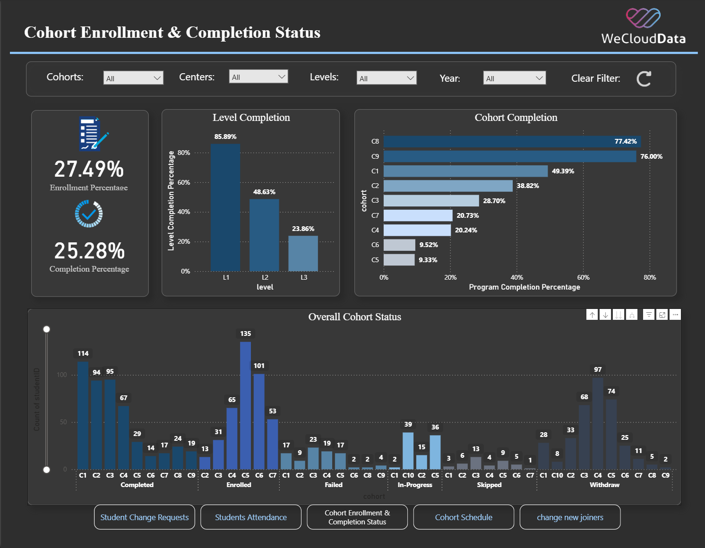
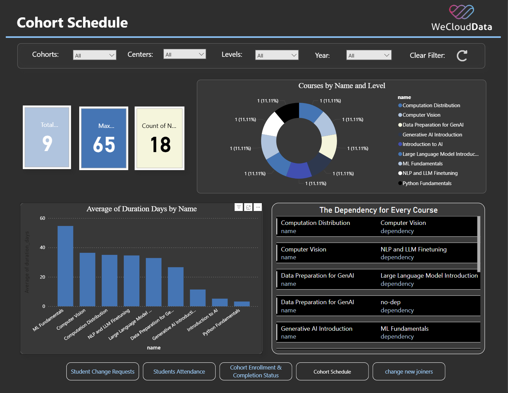
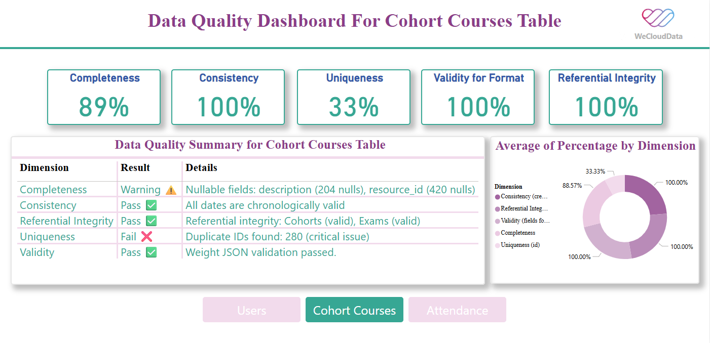
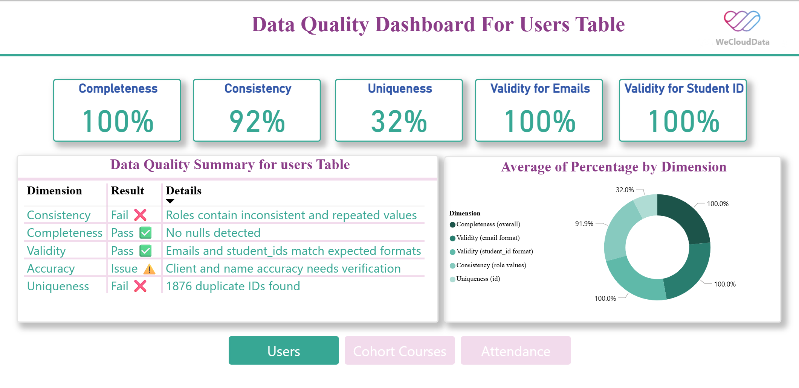

# 📘 Capstone Project – WeCloudData  
**Data Management & Governance Bootcamp**

As data analysts, we designed and implemented a complete data pipeline and governance framework for a simulated **Learning Management System (LMS)** — integrating fragmented sources, performing data cleaning using `SQL` and `Python`, improving data quality, and delivering actionable insights.

---

## 🔷 Stage 1: Local Integration & Data Profiling

> The LMS originally relied on spreadsheets and manual updates, lacking a centralized database — which made it difficult to access, unify, and analyze student performance data effectively.

### ✅ Key Contributions

- ● **Set up a local MySQL environment**  
  Established a structured database to manage LMS data efficiently.

- ● **Imported datasets (CSV/TSV)**  
  Loaded student records, attendance, cohorts, and enrollments.

- ● **Merged files using Python**  
  Combined scattered data into unified, consistent tables.

- ● **Profiled data with SQL**  
  Detected null values, duplicates, and inconsistent data types.

- ● **Cleaned and transformed data**  
  Standardized formats and created normalized relational tables.

- ● **Built professional dashboards**  
  Used **Excel** and **Power BI** to visualize attendance trends and withdrawal rates.

---

## 🖼️ Dashboards – Stage 1

> These dashboards were created during the local integration phase to explore raw data, monitor cohort performance, and uncover initial insights.  
They focus on student attendance, enrollment activity, and scheduling — giving a clear picture of how learners engage at the operational level.

### 🟣 Students Attendance Dashboard  

### 🔄 Student Change Requests Dashboard  

### 🧾 Change New Joiners Dashboard  

### 🎓 Cohort Enrollment Completion  

### 🗓️ Cohort Schedule  

---

## 🔷 Stage 2: Cloud Integration, Data Governance & Dashboard Development

> After the initial local setup, we transitioned to a cloud-based architecture to enhance scalability, automate data pipelines, and implement robust data governance controls.

### ✅ Key Contributions

- ● **Migrated to a cloud MySQL database (AWS RDS)**  
  Configured and connected an AWS RDS instance to enable centralized, secure data storage.

- ● **Built automated ETL pipelines using Airbyte**  
  Extracted and loaded data from local sources into the cloud environment efficiently.

- ● **Cleaned and validated data using Python & SQL**  
  Handled missing values, normalized formats, and ensured schema consistency.

- ● **Implemented data governance checks**  
  Applied DAMA framework principles to evaluate data quality dimensions: completeness, accuracy, consistency, and reliability.

- ● **Performed data profiling and integrity tests**  
  Detected data issues across LMS tables and developed rule-based quality checks.

- ● **Created advanced dashboards in Power BI**  
  Focused on engagement metrics, change requests, and quality scoring of LMS components.

---

## 🖼️ Dashboards – Stage 2

> Built after cloud migration and quality checks, these dashboards focus on student engagement and data integrity.  
They help track system usage, highlight quality issues in key LMS tables, and ensure data is trustworthy for reporting and decision-making.

### 🔥 Student Engagement  

### 🧪 Data Quality – Cohort Courses  

### 📈 Data Quality – Attendance Table  

### 👤 Data Quality – Users Table  

---
