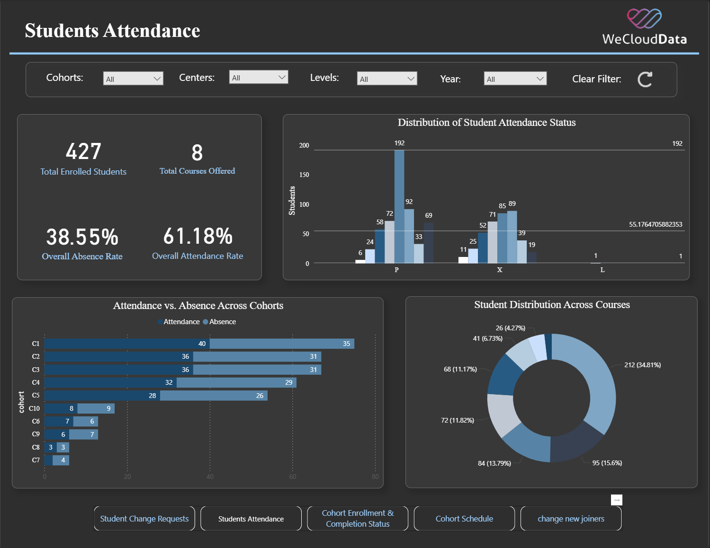
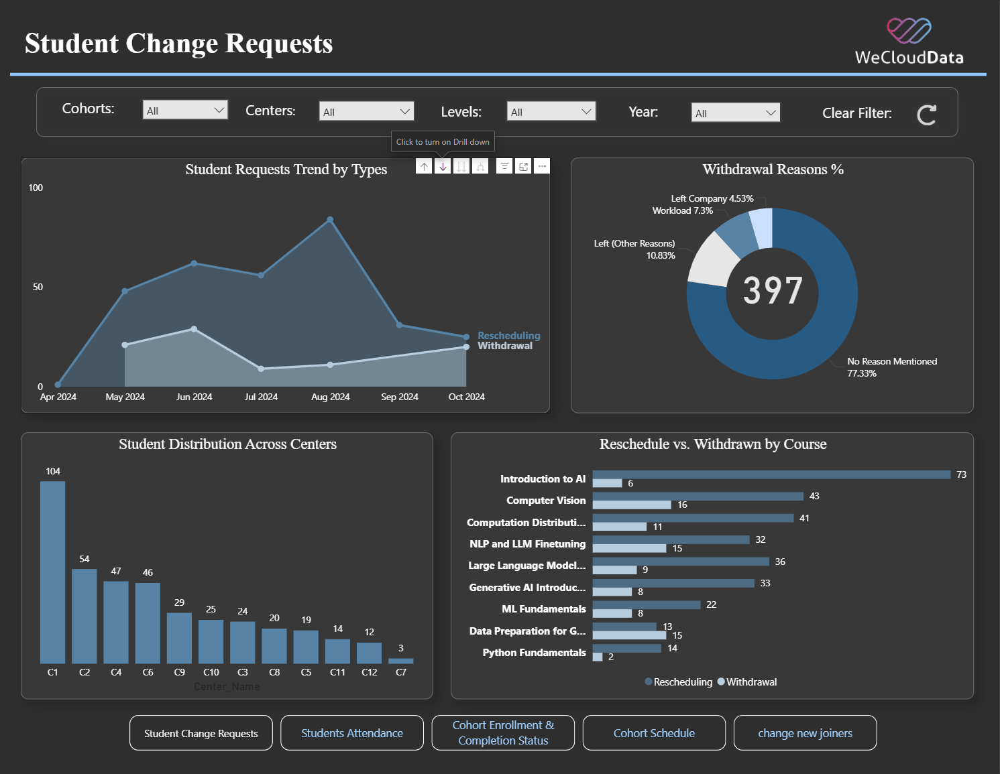
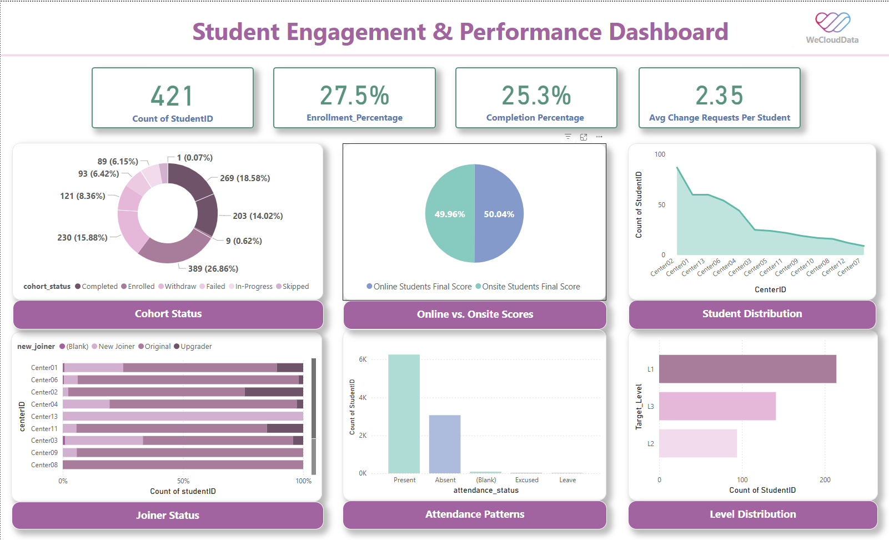
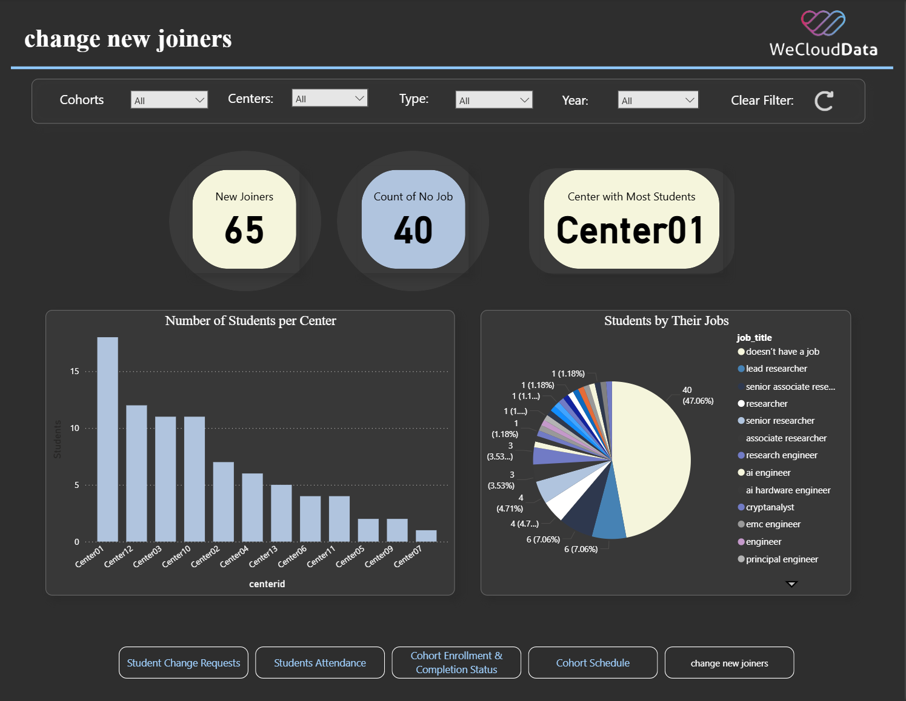
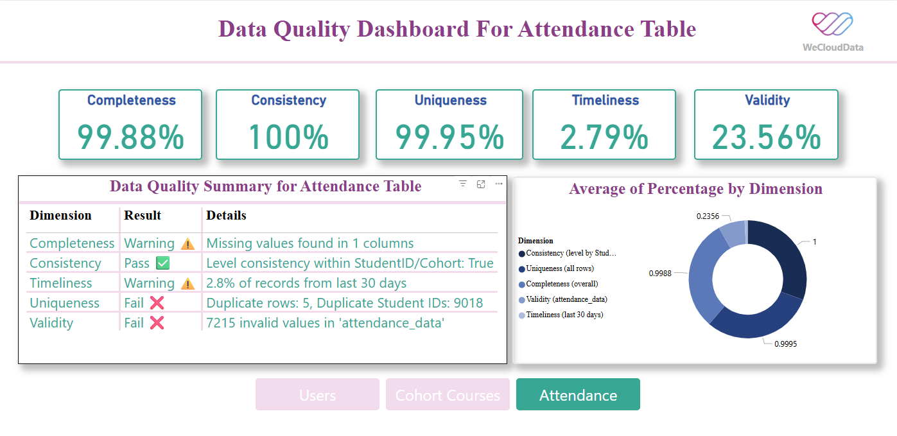

# 📘 Capstone Project – WeCloudData  
**Data Management & Governance Bootcamp**

As data analysts, we designed and implemented a complete data pipeline and governance framework for a simulated **Learning Management System (LMS)** — integrating fragmented sources, performing data cleaning using `SQL` and `Python`, improving data quality, and delivering actionable insights.

---

## 🔷 Stage 1: Local Integration & Data Profiling

> The LMS originally relied on spreadsheets and manual updates, lacking a centralized database — which made it difficult to access, unify, and analyze student performance data effectively.

---

### ✅ Key Contributions

- ● **Set up a local MySQL environment**  
  Established a structured database to manage LMS data efficiently.

- ● **Imported datasets (CSV/TSV)**  
  Loaded student records, attendance, cohorts, and enrollments.

- ● **Merged files using Python**  
  Combined scattered data into unified, consistent tables.

- ● **Profiled data with SQL**  
  Detected null values, duplicates, and inconsistent data types.

- ● **Cleaned and transformed data**  
  Standardized formats and created normalized relational tables.

- ● **Built professional dashboards**  
  Used **Excel** and **Power BI** to visualize attendance trends and withdrawal rates.....

## 📊 Dashboards Preview

### 📌 Students Attendance Dashboard

### 📌 Student Change Requests Dashboard

### 📌 Student Engagement

### 📌 Change New Joiners Dashboard

### 📌 Cohort Enrollment Completion

### 📌 Cohort Schedule

### 📌 Data Quality - Cohort Courses

### 📌 Data Quality - Attendance Table

### 📌 Data Quality - Users Table

---
